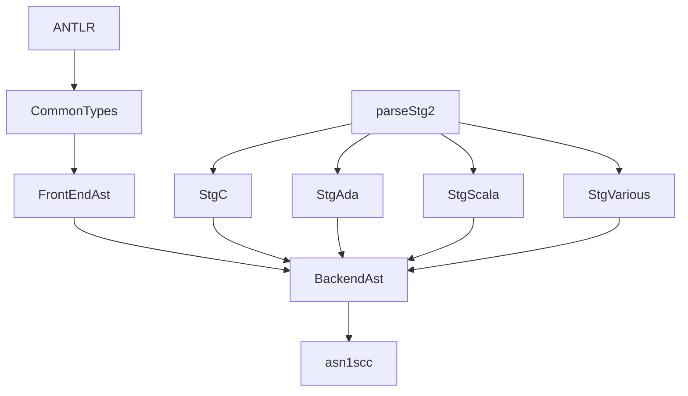

# Architecture Components

This document provides detailed descriptions of the major architectural components in ASN1SCC and their responsibilities.

## Component Overview

### 1. ANTLR Parsers (`Antlr/`)

**Purpose**: Transform ASN.1 and ACN source files into generic Abstract Syntax Trees (ASTs).

**Key Files**:
- `asn1.g` - ANTLR v3 grammar for ASN.1 language
- `acn.g` - ANTLR v3 grammar for ACN language
- Generated C# parsers in `antlr313/` directory

**Responsibilities**:
- Lexical analysis and parsing of ASN.1/ACN source files
- Generate generic ASTs that represent the parsed structure
- Provide error reporting for syntax errors
- Bridge between textual input and structured data

**Data Flow**:
```
ASN.1/ACN Files → ANTLR Lexer → Token Stream → ANTLR Parser → Generic AST
```

**Dependencies**:
- ANTLR 3.13 runtime libraries
- StringTemplate library for AST generation

### 2. CommonTypes (`CommonTypes/`)

**Purpose**: Foundational types, utilities, and cross-cutting concerns used throughout the compiler.

**Key Files**:
- `CommonTypes.fs` - Core type definitions and utilities
- `FsUtils.fs` - F# utility functions and extensions
- `AbstractMacros.fs` - Template abstraction system (generated from STG)
- `RangeSets.fs`, `ValueSets.fs`, `SimpleSets.fs` - Set operation utilities
- `AcnGenericTypes.fs` - ACN-specific generic type definitions
- `RemoveUnusedRtlFunction.fs` - Runtime library optimization

**Responsibilities**:
- Define fundamental data types used across all components
- Provide set operations for constraint handling
- Abstract macro system for cross-language template generation
- Utility functions for F# programming patterns
- Runtime library function management

**Key Types**:
```fsharp
// Core identifier and reference types
type Asn1Ast.ReferenceToType
type Asn1Ast.Asn1Value
type CommonTypes.BigInteger

// Set operations for constraints
type RangeSet<'T>
type ValueSet<'T>
```

### 3. FrontEndAst (`FrontEndAst/`)

**Purpose**: Core AST definitions, transformations, and semantic analysis. This is the heart of the compiler's frontend.

**Architecture**: Multiple AST representations with progressive transformations:

#### 3.1 Generic AST Processing
**Files**: `AntlrParse.fs`, `CreateAsn1AstFromAntlrTree.fs`
- Transform ANTLR generic ASTs into strongly-typed F# ASTs
- Handle basic structural validation
- Convert from C# ANTLR objects to F# discriminated unions

#### 3.2 Parameterized AST (`ParameterizedAsn1Ast.fs`)
**Purpose**: Support for ASN.1 templates/generics (similar to C++ templates)
- Represents ASN.1 types with parameters (e.g., `Matrix{rows, cols}`)
- Handles parameterized type definitions
- Supports generic type constraints

#### 3.3 Template Resolution (`RemoveParameterizedTypes.fs`, `MapParamAstToNonParamAst.fs`)
**Purpose**: Resolve template instantiations into concrete types
```fsharp
// Before resolution: Matrix{INTEGER (1..10), INTEGER (1..20)}
// After resolution: Concrete Matrix type with specific dimensions
```

#### 3.4 Core ASN.1 AST (`Asn1Ast.fs`)
**Purpose**: Final, non-parameterized ASN.1 AST representation
- Complete type hierarchy for all ASN.1 types
- Constraint information and validation rules
- Type reference resolution

**Key ASN.1 Types Supported**:
- Primitive: INTEGER, BOOLEAN, REAL, ENUMERATED
- String Types: UTF8String, IA5String, etc.
- Structured: SEQUENCE, SEQUENCE OF, SET, SET OF, CHOICE
- Binary: BIT STRING, OCTET STRING

#### 3.5 ACN Processing (`AcnCreateFromAntlr.fs`, `AcnGenericCreateFromAntlr.fs`)
**Purpose**: Handle ACN (ASN.1 Control Notation) parsing and integration
- Parse ACN encoding specifications
- Associate ACN encodings with ASN.1 types
- Handle ACN parameters and constraints

#### 3.6 AST Merging (`Asn1AcnAst.fs`)
**Purpose**: Combine ASN.1 structural information with ACN encoding information
```fsharp
type Asn1AcnAst.Asn1Type = {
    Kind: Asn1TypeKind           // ASN.1 structural information
    acnInfo: AcnTypeInfo option  // Optional ACN encoding specification
    Constraints: Asn1Constraint list
    Location: SrcLoc
}
```

#### 3.7 Validation and Checking (`CheckAsn1.fs`)
**Purpose**: Comprehensive semantic validation
- Type compatibility checking
- Constraint validation
- Reference resolution verification
- Circular dependency detection

#### 3.8 Transformation to DAst (`DAst.fs`, `DAstUtilFunctions.fs`)
**Purpose**: Create backend-ready AST with code generation functions
```fsharp
type DAst.Asn1Type = {
    // ... structural info ...
    isValidFunction: IsValidFunction option
    initFunction: InitFunction option
    equalFunction: EqualFunction option
    // ... encoding functions ...
}

type IsValidFunction = {
    funcName: string
    funcBody: CallerScope -> ValidationStatement list
}
```

**Data Flow Through FrontEndAst**:
```
Generic AST → Parameterized AST → Template Resolution → Asn1Ast →
ACN Integration → Asn1AcnAst → Validation → DAst
```

### 4. BackendAst (`BackendAst/`)

**Purpose**: Target language code generation and optimization.

**Architecture**: The BackendAst transforms the language-agnostic DAst into actual source code for target languages (C, Ada, Scala).

#### 4.1 Core Backend Functions
**Files**: `DAstAsn1.fs`, `DAstTypeDefinition2.fs`, `DAstConstruction.fs`

Each ASN.1 type gets several generated functions:
- **Type Definition**: Language-specific type declarations
- **Initialize**: Default value initialization
- **IsEqual**: Value comparison
- **IsValid**: Constraint validation
- **Encoding/Decoding**: uPER, ACN, XER support
- **Test Cases**: Automatic test generation

#### 4.2 Encoding Implementations

**uPER Encoding** (`DAstUPer.fs`):
- Implements Unaligned Packed Encoding Rules
- Bit-level encoding optimizations
- Handles optional fields and extensions

**ACN Encoding** (`DAstACN.fs`):
- Custom binary encoding per ACN specifications
- Support for legacy protocol formats
- Bit field manipulation and alignment

**XER Encoding** (`DAstXer.fs`):
- XML Encoding Rules implementation
- Human-readable XML format
- Schema generation

#### 4.3 Code Generation (`GenerateFiles.fs`)
**Purpose**: Orchestrate the generation of all output files
```fsharp
let generateFiles (r:AstRoot) (deps:Asn1AcnAst.AcnInsertedFieldDependencies) outDir =
    // Generate type definition files
    // Generate encoding/decoding implementations
    // Generate test cases
    // Generate ICDs (Interface Control Documents)
```

#### 4.4 ICD Generation (`GenerateUperIcd.fs`, `GenerateAcnIcd.fs`)
**Purpose**: Generate Interface Control Documents
- HTML documentation for message formats
- Bit-level encoding descriptions
- Test vector generation

### 5. String Template Groups (`Stg*`)

**Purpose**: Language-specific code generation through templates.

#### 5.1 Template Projects
- **StgC**: C language templates
- **StgAda**: Ada/SPARK language templates
- **StgScala**: Scala language templates
- **StgVarious**: Common templates and utilities
- **ST**: StringTemplate infrastructure

#### 5.2 Template Generation Pipeline
```
template.stg → parseStg2.exe → template.stg.fs → F# Interface → BackendAst calls
```

**Example Template Transformation**:
```stg
// In header_c.stg
type_definition(sName, iMaxBits) ::= <<
typedef struct {
    <sName>_data data;
    int exists;
} <sName>;
>>
```

```fsharp
// Generated in header_c.stg.fs
let type_definition (sName:string) (iMaxBits:int) = ...
```

#### 5.3 Abstract Interfaces
Each template group implements the same abstract F# interface:
```fsharp
type ITypeDefinition_c =
    abstract member type_definition : string -> int -> string
    abstract member sequence_definition : string -> string list -> string
    // ... more methods
```

This ensures:
- **Language Consistency**: Same function signatures across C/Ada/Scala
- **Type Safety**: Template calls are statically checked
- **Extensibility**: New parameters can be added to all languages uniformly

### 6. Main Executable (`asn1scc/`)

**Purpose**: Command-line interface, argument parsing, and compilation orchestration.

**Key Files**:
- `Program.fs` - Entry point and argument parsing
- `GenerateRTL.fs` - Runtime library file generation

**Compilation Flow**:
1. Parse command-line arguments
2. Read and parse ASN.1/ACN files
3. Transform through FrontEndAst pipeline
4. Generate code via BackendAst
5. Output files to target directory

**Command-Line Interface**:
```bash
asn1scc -c -uPER -o output/ input.asn1 input.acn
```

## Component Dependencies



## Error Handling and Debugging Locations

**Parse Errors**: Start in `Antlr/` generated parsers and `FrontEndAst/AntlrParse.fs`

**Type Resolution Issues**: Check `FrontEndAst/RemoveParameterizedTypes.fs` and `FrontEndAst/CheckAsn1.fs`

**Constraint Violations**: Look in `CommonTypes/RangeSets.fs` and validation functions in `BackendAst/DastValidate2.fs`

**Code Generation Problems**: Examine target-specific `Stg*` projects and `BackendAst/GenerateFiles.fs`

**Runtime Issues**: Check the runtime library folders (`asn1crt/`, `ADA_RTL2/`, `asn1scala/`)

This architecture enables ASN1SCC to handle complex ASN.1/ACN specifications while maintaining code quality across multiple target languages.